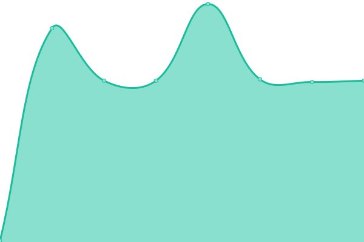

# [📈 Live Status](https://status.zerlio.com): <!--live status--> **🟧 Partial outage**

This repository contains the open-source uptime monitor and status page for [zerlio](https://status.zerlio.com), powered by [Upptime](https://github.com/upptime/upptime).

With [Upptime](https://upptime.js.org), you can get your own unlimited and free uptime monitor and status page, powered entirely by a GitHub repository. We use [Issues](https://github.com/zerlio/zerlio-status/issues) as incident reports, [Actions](https://github.com/zerlio/zerlio-status/actions) as uptime monitors, and [Pages](https://status.zerlio.com) for the status page.

<!--start: status pages-->
<!-- This summary is generated by Upptime (https://github.com/upptime/upptime) -->
<!-- Do not edit this manually, your changes will be overwritten -->
<!-- prettier-ignore -->
| URL | Status | History | Response Time | Uptime |
| --- | ------ | ------- | ------------- | ------ |
|  [App (Web)](https://app.zerlio.com/) | 🟥 Down | [app-web.yml](https://github.com/zerlio/zerlio-status/commits/HEAD/history/app-web.yml) | 

 0ms
     
 | 

<a href="https://status.zerlio.com/history/app-web">0.00%</a>
    

|  [App API Health](https://app.zerlio.com/api/v1/health) | 🟥 Down | [app-api-health.yml](https://github.com/zerlio/zerlio-status/commits/HEAD/history/app-api-health.yml) | 

 0ms
     
 | 

<a href="https://status.zerlio.com/history/app-api-health">0.00%</a>
    

|  [Beta (Web)](https://beta.zerlio.com/) | 🟩 Up | [beta-web.yml](https://github.com/zerlio/zerlio-status/commits/HEAD/history/beta-web.yml) | 

 522ms
     
 | 

<a href="https://status.zerlio.com/history/beta-web">100.00%</a>
    

|  [Beta API Health](https://beta.zerlio.com/api/v1/health) | 🟩 Up | [beta-api-health.yml](https://github.com/zerlio/zerlio-status/commits/HEAD/history/beta-api-health.yml) | 

 150ms
     
 | 

<a href="https://status.zerlio.com/history/beta-api-health">100.00%</a>
    

|  [Mail SMTP (587)](mail.zerlio.com) | 🟩 Up | [mail-smtp-587.yml](https://github.com/zerlio/zerlio-status/commits/HEAD/history/mail-smtp-587.yml) | 

 148ms
     
 | 

<a href="https://status.zerlio.com/history/mail-smtp-587">0.05%</a>
    

<!--end: status pages-->

[**Visit our status website →**](https://status.zerlio.com)

## 📄 License

- Powered by: [Upptime](https://github.com/upptime/upptime)
- Code: [MIT](./LICENSE) © [Anand Chowdhary](https://anandchowdhary.com), supported by [Pabio](https://pabio.com)
- Data in the `./history` directory: [Open Database License](https://opendatacommons.org/licenses/odbl/1-0/)
